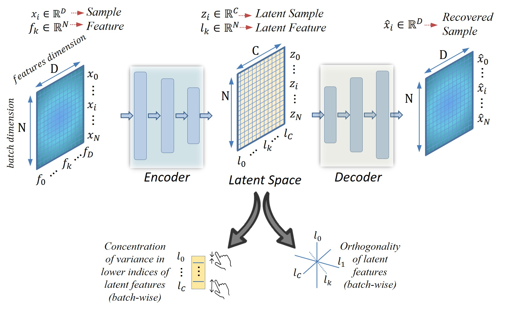
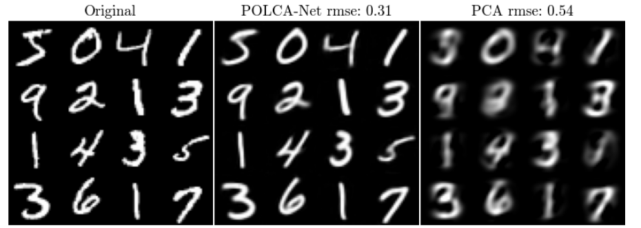
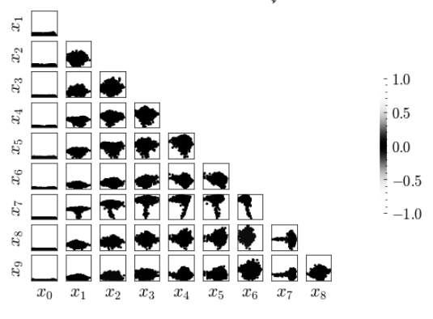
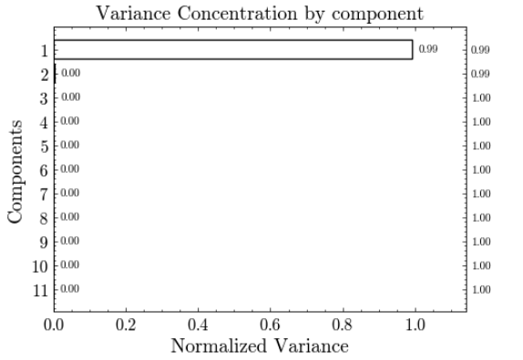

# POLCA Net: *P*rincipal *O*rthogonal *L*atent *C*omponents *A*nalysis Network

POLCA Net is a novel deep learning architecture designed to extend PCA and LDA capabilities to non-linear domains. It combines an autoencoder framework with specialized loss functions to achieve effective dimensionality reduction, orthogonality, variance-based feature sorting, and high-fidelity reconstructions.

	

Features:

- Orthogonal latent features
- Data compression and dimensionality reduction
- Conentrates variance in early dimensions (as PCA)
- Optional learning with labels (similar to LDA functionality)
- Optional linear decoder for theoretical guarantees

Loss Function:

POLCA Net uses a composite loss function:

$L_{polca} = L_{rec} + L_{class} + \alpha  L_{ort} + \beta L_{com} + \gamma L_{var}$

Where:
- $L_{rec}$: Reconstruction loss
- $L_{class}$: Optional classification loss
- $L_{ort}$: Orthogonality enforcing loss
- $L_{com}$: Center of mass loss (dimensionality reduction)
- $L_{var}$: Variance regularization loss

Experimental Results:

POLCA Net has been tested on 16 diverse datasets, including MNIST, FashionMNIST, and MedMNIST. It consistently outperformed PCA in both classification and reconstruction tasks.

### MNIST example with 11 components for PolcaNet and PCA:

### Cosine similarity between the first 11 components of PolcaNet and PCA:

### Variance concentrating in the first 11 components of PolcaNet:

###  Comparison of classification results for the features extracted by PolcaNet and PCA (without using labels):
Classifier, split (Test/Train), metrics (Accuracy, Precision, Recall, F1-Score), and transformation method (PCA/POLCA).

| Classifier | Split | Metric | PCA | POLCA |
|------------|-------|--------|-----|-------|
| Linear SVM | Test  | Accuracy | 0.8474 | 0.9352 |
|            |       | Precision | 0.8471 | 0.9352 |
|            |       | Recall | 0.8474 | 0.9352 |
|            |       | F1-Score | 0.8469 | 0.9351 |
|            | Train | Accuracy | 0.8439 | 0.9330 |
|            |       | Precision | 0.8433 | 0.9329 |
|            |       | Recall | 0.8439 | 0.9330 |
|            |       | F1-Score | 0.8433 | 0.9329 |
| Logistic Regression | Test | Accuracy | 0.8103 | 0.9212 |
|                     |      | Precision | 0.8094 | 0.9211 |
|                     |      | Recall | 0.8103 | 0.9212 |
|                     |      | F1-Score | 0.8096 | 0.9211 |
|                     | Train | Accuracy | 0.8069 | 0.9154 |
|                     |       | Precision | 0.8058 | 0.9153 |
|                     |       | Recall | 0.8069 | 0.9154 |
|                     |       | F1-Score | 0.8061 | 0.9153 |
| Perceptron | Test  | Accuracy | 0.6993 | 0.8655 |
|            |       | Precision | 0.7078 | 0.8711 |
|            |       | Recall | 0.6993 | 0.8655 |
|            |       | F1-Score | 0.6930 | 0.8635 |
|            | Train | Accuracy | 0.6888 | 0.8609 |
|            |       | Precision | 0.6945 | 0.8672 |
|            |       | Recall | 0.6888 | 0.8609 |
|            |       | F1-Score | 0.6802 | 0.8587 |
| Ridge Classifier | Test | Accuracy | 0.7167 | 0.8548 |
|                  |      | Precision | 0.7401 | 0.8616 |
|                  |      | Recall | 0.7167 | 0.8548 |
|                  |      | F1-Score | 0.6909 | 0.8483 |
|                  | Train | Accuracy | 0.7034 | 0.8480 |
|                  |       | Precision | 0.7312 | 0.8558 |
|                  |       | Recall | 0.7034 | 0.8480 |
|                  |       | F1-Score | 0.6758 | 0.8412 |
 

## Requirements:

- Python 3.12
- PyTorch 
- CUDA 

## Citation:

If you use POLCA Net in your research, please cite our paper:

@article{martin2024polcanet,
  title={Principal Orthogonal Latent Components Analysis (POLCA Net)},
  author={Martin H., Jose Antonio and Perozo, Freddy and Lopez, Manuel},
  journal={arXiv preprint arXiv:XXXX.XXXXX},
  year={2024}
}

## License:

MIT License

Contributors:

- Jose Antonio Martin H. (xjamartinh@gmail.com)
- Freddy Perozo 
- Manuel Lopez 

Acknowledgments:

This work was conducted at Repsol Technology Lab.
